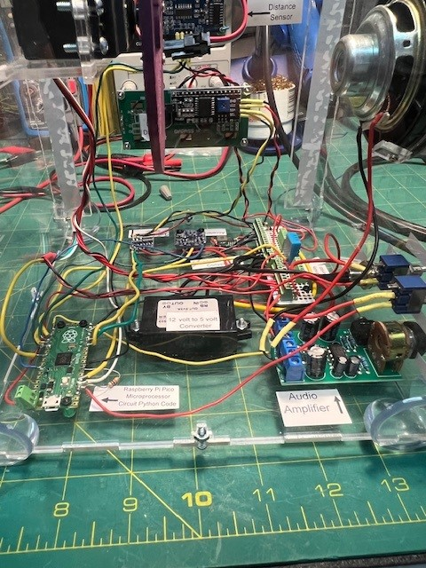
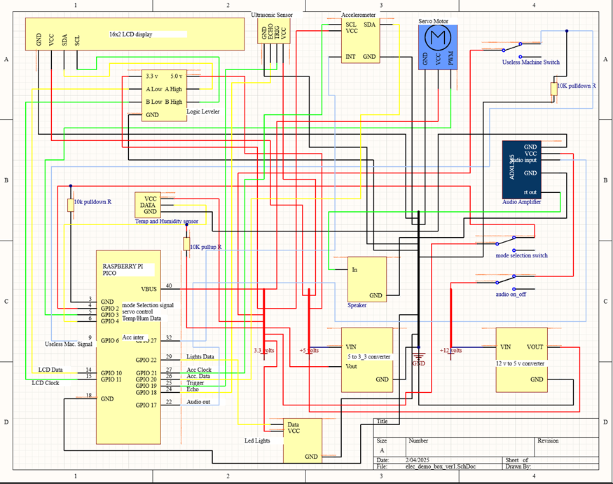

# elect_demo_box_feb_25
This is the code for my electronics demo box.  The main program is: start_demo_box.py.  Code.py launches when the box is given power.  The code in code.py selects whether it enters into the demo mode or the standby mode.

