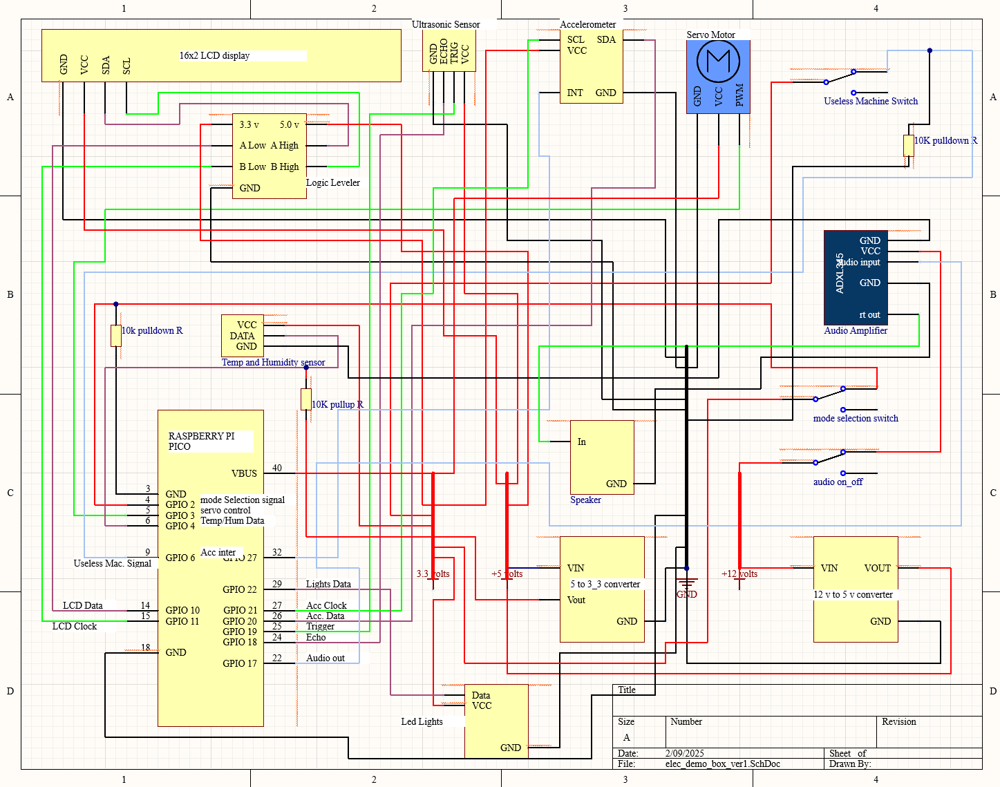

# elect_demo_box_feb_25
This code runs the "electronics demonstration box."
When power is applied to the box, "code.py" is launched.  The main program is "start_demo_box.py."  
A switch on the side of the box tells "code.py" whether to start the box in "demo mode" or "standby mode".

In "standby mode" the box will (1) display the name of the maker space, (2) light up the led strips, (3) sense whether the "useless machine" switch has been flipped, and (4) sense whether there have been two "taps--which, if there has been--it will tell you one of six pre-recorded knock-knock jokes.

In "demo mode" the box will loop through the following:
(1) it will play and introduction message
(2) it will point out that it can play sounds
(3) it will flash colored patterns with the LED strips
(4) it will display texts on the screen
(5) it will display the current temp and humidity inside the box
(6) it will display the tilt information and invite the user to tap twice on the box.  At which point, it will tell a joke and invite you to tap on it again.  At which point it will tell one of six knock-knock jokes
(7) it will invite you to move your hand in front of the ultrasonic sensor and it will (a) display the distance detected and (b) adjust the color of the lights to fit with the distance detected.
(8) it will invite you to flip the switch on the top to initiate the "useless machine" function
(9) it tell you that it hopes that you have been inspired to incorporate electronics into some of your projects.

The subdirectory "test_files" contains all of the code that I used to test each of the components in isolation.

